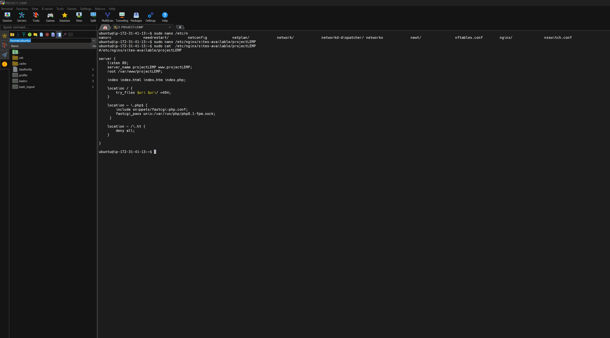
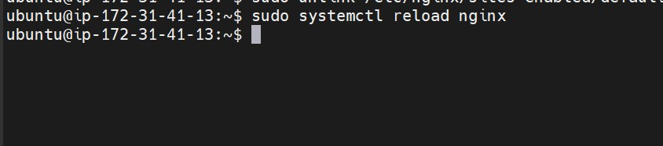
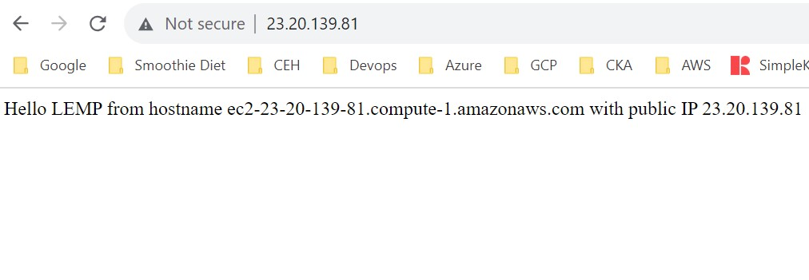

# WEB STACK IMPLEMENTATION (LEMP STACK) ON AWS

## STEP 1 – INSTALLING THE NGINX WEB SERVER

sudo apt update

sudo apt install nginx

sudo systemctl status nginx

TCP 80

Nginx Page

# STEP 2 — INSTALLING MYSQL

sudo apt install mysql-server

sudo mysql 

sudo mysql_secure_installation

sudo mysql -p

# STEP 3 – INSTALLING PHP 

sudo apt install php-fpm php-mysql

# STEP 4 — CONFIGURING NGINX TO USE PHP PROCESSOR

sudo mkdir /var/www/projectLEMP 

sudo chown -R $USER:$USER /var/www/projectLEMP

sudo nano /etc/nginx/sites-available/projectLEMP

 sudo ln -s /etc/nginx/sites-available/projectLEMP /etc/nginx/sites-enabled/

sudo nginx -t

sudo unlink /etc/nginx/sites-enabled/default

$ sudo systemctl reload nginx

LEMP Stack Page

# STEP 5 – TESTING PHP WITH NGINX

sudo nano /var/www/projectLEMP/info.php

sudo rm /var/www/your_domain/info.php

# STEP 6 – RETRIEVING DATA FROM MYSQL DATABASE WITH PHP

sudo mysql -p

CREATE DATABASE example_database; 

CREATE USER AND SHOW DATABASE

TO DO Code

To Do Webpage APP

